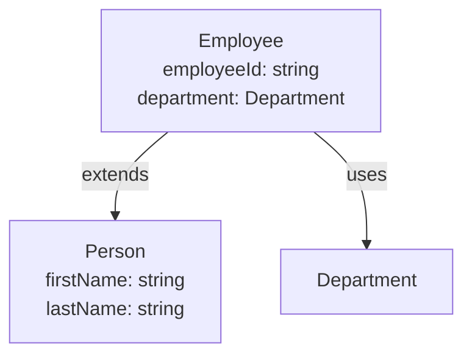
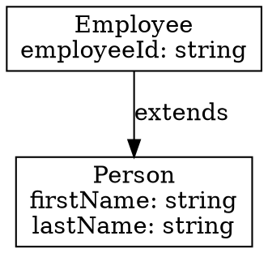

# FINOS CDM Viewer - ユーザーガイド

FINOS CDM Viewer for Visual Studio Codeへようこそ！このガイドでは、Rosetta DSLで記述されたFINOS Common Domain Model（CDM）ファイルを効率的に扱うための拡張機能の使い方を詳しく説明します。

## 目次

1. [はじめに](#はじめに)
2. [セットアップ](#セットアップ)
3. [主要機能](#主要機能)
4. [ナビゲーション機能](#ナビゲーション機能)
5. [編集機能](#編集機能)
6. [可視化機能](#可視化機能)
7. [実践的なワークフロー](#実践的なワークフロー)
8. [ヒントとベストプラクティス](#ヒントとベストプラクティス)
9. [トラブルシューティング](#トラブルシューティング)

---

## はじめに

### FINOS CDM Viewerとは？

FINOS CDM Viewerは、FINOS Common Domain Modelファイルの作業を効率化するためのVS Code拡張機能です。以下の機能を提供します：

- **ナビゲーション**: 型や列挙型の定義を素早く閲覧・ジャンプ
- **編集サポート**: IntelliSense、コード補完、リファクタリングツール
- **可視化**: 型の関係を示す対話的なグラフ
- **検証**: リアルタイムのエラー検出と診断
- **エクスポート**: 複数の形式でドキュメントを生成

### 対象ユーザー

- FINOS CDMを使用する金融ドメインモデラー
- CDMベースのアプリケーションを開発する開発者
- CDMスキーマを文書化するテクニカルライター
- Rosetta DSLファイルを扱うすべての方

---

## セットアップ

### 前提条件

- Visual Studio Code 1.85.0 以上
- `.rosetta`ファイルを含むワークスペース（例：FINOS CDMリポジトリ）

### インストール

詳細なインストール手順は [INSTALLATION-ja.md](INSTALLATION-ja.md) を参照してください。

### 最初のCDMプロジェクトを開く

1. **FINOS CDMリポジトリをクローン**（まだの場合）：
   ```bash
   git clone https://github.com/finos/common-domain-model.git
   cd common-domain-model
   ```

2. **VS Codeで開く**：
   ```bash
   code .
   ```

3. **インデックス作成を待つ**: 拡張機能が自動的にワークスペース内のすべての`.rosetta`ファイルをインデックス化します。大規模プロジェクトでは数秒かかる場合があります。

4. **CDM Explorerを確認**: インデックス作成が完了すると、エクスプローラーサイドバーに「CDM Explorer」ビューが表示されます。

---

## 主要機能

### 1. CDM Explorerツリービュー

CDM Explorerは、ワークスペース内のすべての型と列挙型を階層的に表示します。

**使い方：**

1. エクスプローラーサイドバーの「CDM Explorer」パネルを見つける
2. 名前空間を展開して型と列挙型を表示
3. 型を展開すると以下が表示されます：
   - 親型（継承）
   - フィールドとその型、カーディナリティ
   - 検証条件
4. 列挙型を展開すると値が表示されます

**表示例：**
```
📁 cdm.sample.test
  ├─ 📘 Person
  │   ├─ firstName: string (1..1)
  │   ├─ lastName: string (1..1)
  │   ├─ age: int (0..1)
  │   └─ address: Address (0..1)
  ├─ 📘 Employee (extends Person)
  │   ├─ employeeId: string (1..1) [metadata id]
  │   ├─ department: Department (1..1)
  │   └─ salary: number (0..1)
  └─ 🔢 Department
      ├─ ENGINEERING
      ├─ SALES
      └─ MARKETING
```

**ヒント：**
- 任意の項目をクリックすると、エディタでその定義を開きます
- 更新ボタン（🔄）を使用して手動でツリーを更新できます
- ファイルを保存すると、ツリーは自動的に更新されます

### 2. シンタックスハイライト

すべての`.rosetta`ファイルは自動的に以下の要素がカラーリングされます：
- キーワード（`type`、`enum`、`namespace`、`extends`など）
- 型名と参照
- 文字列リテラルと数値
- メタデータアノテーション（`[metadata key]`など）
- コメント
- カーディナリティ指定（`0..1`、`1..*`など）

**設定不要** - `.rosetta`ファイルを開くだけでシンタックスハイライトが有効になります。

---

## ナビゲーション機能

### 3. ホバー情報

**使い方：**
- 任意の型名または列挙型名にマウスカーソルを合わせます

**表示される情報：**
- 型または列挙型の説明
- 型の場合：フィールドのリストとその型・カーディナリティ
- 列挙型の場合：値のリスト
- 名前空間情報

**表示例：**
```
「Address」にカーソルを合わせると：
┌────────────────────────────────────┐
│ Address                             │
│ Type from cdm.sample.test          │
│                                    │
│ 物理的な住所を表します              │
│                                    │
│ フィールド：                        │
│  • street: string (1..1)           │
│  • city: string (1..1)             │
│  • postalCode: string (1..1)       │
│  • country: Country (1..1)         │
└────────────────────────────────────┘
```

### 4. 定義へジャンプ (F12)

**使い方：**
1. 型または列挙型名にカーソルを置く
2. `F12`キーを押す、または `Cmd+クリック`（macOS）/`Ctrl+クリック`（Windows/Linux）

**動作：**
- エディタがその型または列挙型の定義にジャンプします
- ワークスペース内の異なるファイル間でも動作します

**使用例：**
- 型の継承チェーンをたどる
- フィールドの型を理解する
- 複雑なドメインモデルをナビゲートする

### 5. すべての参照を検索 (Shift+F12)

**使い方：**
1. 型または列挙型名にカーソルを置く
2. `Shift+F12`キーを押す、または右クリック→「すべての参照を検索」

**表示される情報：**
- この型/列挙型が使用されているすべての場所のリスト
- 以下を含みます：
  - 型の拡張（`Employee extends Person`）
  - フィールド型の参照（`address: Address`）
  - 関数のパラメータと戻り値の型

**出力例：**
```
'Address'への参照：
  sample.rosetta (3箇所)
    13行目: address Address (0..1)
    18行目: type Address :
    52行目: primaryAddress Address (1..1)
```

---

## 編集機能

### 6. コード補完 (Ctrl+Space / Cmd+Space)

拡張機能は、さまざまなコンテキストでインテリジェントなコード補完を提供します。

#### 型の補完

**フィールドの型やextends句を入力する際：**

```rosetta
type Employee extends P█    ← Ctrl+Spaceを押す
```

**候補：**
- プリミティブ型：`string`、`int`、`number`、`boolean`、`date`、`time`、`dateTime`、`zonedDateTime`
- ワークスペースのカスタム型：`Person`、`Address`、`Employee`など

#### キーワードの補完

**行の先頭で：**

```rosetta
█    ← Ctrl+Spaceを押す
```

**スニペット付きの候補：**
- `namespace` → `namespace ${1:name}`
- `type` → `type ${1:Name}:\n\t$0`
- `enum` → `enum ${1:Name}:\n\t$0`
- `extends` → `extends ${1:BaseType}`

#### メタデータの補完

**メタデータアノテーション内で：**

```rosetta
firstName string (1..1)
    [metadata █    ← Ctrl+Spaceを押す
```

**候補：**
- `key` - フィールドを一意の識別子としてマーク
- `id` - フィールドを識別子としてマーク
- `reference` - フィールドを別のエンティティへの参照としてマーク
- `scheme` - フィールドを分類スキームに関連付け
- `calculation` - フィールドを計算値としてマーク

#### カーディナリティの補完

**括弧の開始後：**

```rosetta
firstName string (█    ← Ctrl+Spaceを押す
```

**候補：**
- `0..1` - オプション（0個または1個）
- `1..1` - 必須（正確に1個）
- `0..*` - 0個以上
- `1..*` - 1個以上

### 7. 検証と診断

拡張機能はRosettaファイルをリアルタイムで検証し、波線でエラーを表示します。

#### 検証ルール

1. **未定義の型参照**（エラー）
   ```rosetta
   address UnknownType (0..1)  ← 赤い波線
           ~~~~~~~~~~~
   エラー：フィールド型'UnknownType'が定義されていません
   ```

2. **循環継承**（エラー）
   ```rosetta
   type A extends B :
   type B extends A :  ← 赤い波線
   エラー：型'B'は循環継承しています
   ```

3. **無効なカーディナリティ**（エラー）
   ```rosetta
   age int (5..1)  ← 赤い波線
           ~~~~~~
   エラー：無効なカーディナリティ：min (5) > max (1)
   ```

4. **重複するフィールド名**（エラー）
   ```rosetta
   type Person :
       name string (1..1)
       name string (0..1)  ← 赤い波線
       ~~~~
   エラー：型'Person'内でフィールド名'name'が重複しています
   ```

5. **空の型**（警告）
   ```rosetta
   type Empty :  ← 黄色い波線
        ~~~~~
   警告：型'Empty'にフィールドが定義されていません
   ```

#### 検証のタイミング

- ファイルを開いたとき
- ファイルを保存したとき（再インデックス化も実行）
- 入力中（ラグを避けるため500msのデバウンス）
- ディスク上のファイルが変更されたとき

### 8. シンボルの名前変更 (F2)

**使い方：**
1. 型または列挙型名にカーソルを置く
2. `F2`キーを押す、または右クリック→「シンボルの名前変更」
3. 新しい名前を入力
4. `Enter`キーを押す

**動作：**
- 拡張機能がすべての出現箇所（定義+参照）を検索
- すべてのファイルをアトミックに更新
- 適用前に新しい名前を検証

**検証チェック：**
- 新しい名前はPascalCaseである必要があります（例：`MyType`、`PersonEnum`）
- 既存のシンボルとの競合がないこと
- プリミティブ型名ではないこと
- 空ではなく、旧名と異なること

**例：**
```
変更前：                          変更後（Address → Locationに名前変更）：
type Person :                    type Person :
  address Address (0..1)   →       address Location (0..1)

type Address :                   type Location :
  street string (1..1)             street string (1..1)
```

---

## 可視化機能

### 9. 型グラフの可視化

**使い方：**

**方法1：カーソル位置から**
1. エディタで型名にカーソルを置く
2. `Cmd+Shift+P` / `Ctrl+Shift+P` → 「CDM: Show Type Graph」
3. その型に焦点を当てたグラフが表示されます

**方法2：コマンドパレットから**
1. `Cmd+Shift+P` / `Ctrl+Shift+P`を押す
2. 「CDM: Show Type Graph」と入力
3. 「すべての型を表示」または「型名を入力」を選択

**方法3：コンテキストメニューから**
1. `.rosetta`ファイル内で右クリック
2. 「CDM: Show Type Graph」を選択

**表示内容：**

以下を示す対話的なMermaidダイアグラム：
- **継承関係**：子型から親型への矢印
- **フィールドの依存関係**：どの型が他の型を使用しているかを示す接続
- **列挙型の使用**：列挙型が型でどのように参照されているか

**Employeeのグラフ例：**
```
    Person
      ↑
      │ extends
      │
    Employee ──→ Department (enum)
      ↓ references
    Address ──→ Country (enum)
```

**グラフの操作：**
- **ズーム**：マウスホイールまたはピンチジェスチャー
- **パン**：クリック＆ドラッグ
- **エクスポート**：「Export SVG」ボタンをクリックしてダイアグラムを保存

**使用例：**
- 型の階層構造を理解する
- リファクタリング前に依存関係を見つける
- ドキュメント用のダイアグラムを作成する
- 変更の影響を分析する

### 10. 検索とフィルター

**使い方：**
1. `Cmd+Shift+P` / `Ctrl+Shift+P`を押す
2. 「CDM: Search Types and Enums」と入力
3. 検索クエリを入力

**検索機能：**

#### あいまい検索
- 部分名を入力：`pers`は`Person`、`PersonId`、`ReversePerson`にマッチ
- 文字単位のマッチング：`prn`は`Person`にマッチ
- 大文字小文字を区別しない

#### フィルターボタン

検索後、フィルターボタンを使用して結果を絞り込みます：

- **すべて** - すべての結果を表示（デフォルト）
- **型** - 型定義のみを表示
- **列挙型** - 列挙型定義のみを表示
- **フィールド** - フィールドマッチのみを表示
- **名前空間別** - 特定の名前空間でフィルター
- **説明あり** - 説明があるアイテムのみを表示
- **説明なし** - 説明がないアイテムのみを表示

**ワークフロー例：**
```
1. 「address」を検索
   結果：Address（型）、addressLine（フィールド）、primaryAddress（フィールド）

2. 「型」フィルターをクリック
   結果：Address（型）

3. 「cdm.base」名前空間フィルターをクリック
   結果：cdm.base名前空間のAddress（型）のみ
```

**ナビゲーション：**
- 任意の結果をクリックして定義にジャンプ
- フィルターを絞り込むと結果が更新されます

### 11. 複数形式へのエクスポート

**使い方：**
1. `Cmd+Shift+P` / `Ctrl+Shift+P`を押す
2. 「CDM: Export to JSON/Mermaid/GraphViz」と入力
3. エクスポート範囲を選択：
   - 「すべての型をエクスポート」 - ワークスペース全体
   - 「特定の型をエクスポート」 - 依存関係を含む単一の型
   - 「TypeNameをエクスポート」 - カーソル下の現在の型（利用可能な場合）
4. 形式を選択：
   - **JSON** - 完全な型定義
   - **Mermaid** - ダイアグラムマークアップ
   - **GraphViz** - Graphviz用のDOT形式

#### JSONエクスポート

**含まれる内容：**
- 完全な型と列挙型の定義
- 型、カーディナリティ、メタデータを含むすべてのフィールド
- 説明とドキュメント
- 名前空間の整理

**使用例：**
- APIドキュメントの生成
- スキーマ検証
- ツール統合
- バックアップとバージョン管理

**出力例：**
```json
{
  "exportDate": "2026-01-16T10:30:00Z",
  "version": "1.0.0",
  "namespaces": {
    "cdm.sample.test": {
      "types": [
        {
          "name": "Person",
          "description": "人を表します",
          "fields": [
            {
              "name": "firstName",
              "type": "string",
              "cardinality": { "min": 1, "max": 1 }
            }
          ]
        }
      ]
    }
  }
}
```

#### Mermaidエクスポート

**含まれる内容：**
- そのまま使用できるMermaidダイアグラム構文
- 継承とフィールドの関係を表示
- Markdownドキュメントに埋め込み可能

**使用例：**
- GitHub/GitLabドキュメント
- Confluenceページ
- 技術仕様書
- READMEファイル

**出力例：**


#### GraphVizエクスポート

**含まれる内容：**
- プロフェッショナルなグラフレンダリング用のDOT形式
- 詳細な型情報
- カスタマイズ可能なレイアウト

**使用例：**
- 高品質な印刷ドキュメント
- 技術プレゼンテーション
- アーキテクチャダイアグラム
- プロフェッショナルな出版物

**出力例：**


---

## 実践的なワークフロー

### ワークフロー1：既存の型を理解する

**目標：** `Employee`型とその関係を理解する

1. **型を見つける**：CDM Explorerを使用するか、検索（`Cmd+P` → `employee.rosetta`）
2. **定義を表示**：ツリーで`Employee`をクリックするか、`F12`を押す
3. **継承を確認**：`extends Person`を確認 - `Person`にカーソルを合わせて詳細を表示
4. **フィールドを調べる**：ツリーで`Employee`を展開してすべてのフィールドを表示
5. **使用箇所を見つける**：`Employee`で`Shift+F12`を押して使用箇所を表示
6. **可視化**：「CDM: Show Type Graph」を実行して全体像を表示

### ワークフロー2：新しい型を追加する

**目標：** 新しい`Department`型を作成する

1. **`.rosetta`ファイルを開くまたは作成**
2. **入力開始**：`type`と入力して`Tab`キー（スニペット補完）
3. **型に名前を付ける**：`type Department :`
4. **フィールドを追加**：
   ```rosetta
   name string (1..1)
       <"部署名">
   ```
   - 型の補完には`Ctrl+Space`を使用
   - `(`の後のカーディナリティ補完には`Ctrl+Space`を使用
5. **必要に応じてメタデータを追加**：
   ```rosetta
   [metadata key]
   ```
6. **保存**：ファイルは自動的に検証されます
7. **エラーをチェック**：波線を修正
8. **テスト**：他の型のフィールドで新しい型を使用してみる

### ワークフロー3：型名のリファクタリング

**目標：** `Address`を`Location`に名前変更

1. **型を見つける**：`Address`定義に移動
2. **影響を確認**：`Shift+F12`を押してすべての参照を表示
3. **名前変更**：`F2`を押し、`Location`と入力して`Enter`
4. **検証**：すべての参照が自動的に更新されます
5. **テスト**：すべてのファイルを保存して検証エラーをチェック
6. **コミット**：Gitを使用している場合、変更を確認してコミット

### ワークフロー4：ドメインモデルの文書化

**目標：** HRドメインのドキュメントを作成

1. **型を特定**：検索を使用してすべてのHR関連の型を見つける
2. **Mermaidにエクスポート**：「CDM: Export」を実行 → HR名前空間を選択 → Mermaid
3. **ダイアグラムを保存**：`docs/hr-model.md`に貼り付け
4. **JSONにエクスポート**：同じ型をJSONにエクスポートしてAPIドキュメント用に
5. **型グラフを生成**：各主要型の視覚的ダイアグラムを作成
6. **SVGにエクスポート**：プレゼンテーション用にSVGファイルを保存

### ワークフロー5：スキーマ変更の検証

**目標：** 変更が既存の定義を壊さないことを確認

1. **変更を行う**：型定義を編集
2. **エラーを監視**：リアルタイム検証が問題を即座に表示
3. **未定義の型を修正**：コード補完を使用して有効な型を選択
4. **循環依存をチェック**：循環継承エラーを探す
5. **カーディナリティを検証**：min ≤ maxを確認
6. **影響を受ける型を見つける**：変更された型で「すべての参照を検索」を使用
7. **依存関係を更新**：必要に応じて依存する型を変更
8. **完全検索を実行**：影響を受ける可能性のあるパターンを検索
9. **前後をエクスポート**：JSONエクスポートを比較して変更を文書化

---

## ヒントとベストプラクティス

### パフォーマンスのヒント

1. **大規模ワークスペース**：初回のインデックス作成に数秒かかる場合があります。その後の更新は増分で高速です。
2. **効率的な検索**：特定の検索語とフィルターを使用して結果を素早く絞り込む
3. **未使用のグラフを閉じる**：型グラフパネルはメモリを使用 - 使用後は閉じる

### 生産性のヒント

1. **キーボードショートカットを覚える**：
   - `F12` - 定義へジャンプ（最もよく使います！）
   - `Shift+F12` - 参照を検索
   - `F2` - シンボルの名前変更
   - `Ctrl+Space` - コード補完

2. **コード補完を積極的に使う**：入力するより速く、タイプミスを防ぎます

3. **検証を活用**：コンパイルを待たずに、入力中にエラーを修正

4. **早めに頻繁にエクスポート**：開発中にドキュメント用のダイアグラムを生成

### モデリングのベストプラクティス

1. **説明を追加**：すべての型、列挙型、フィールドに`<"説明">`を使用
   - ドキュメントに役立つ
   - ホバーツールチップに表示される
   - チームの理解を助ける

2. **意味のある名前を使用**：型/列挙型はPascalCase、フィールドはcamelCase

3. **継承をチェック**：`extends`を追加する前に型グラフを使用して階層を可視化

4. **カーディナリティを検証**：必須フィールドとオプションフィールドを明示的に

5. **メタデータを文書化**：フィールドが特定のメタデータアノテーションを持つ理由をコメント

---

## トラブルシューティング

### CDM Explorerが表示されない

**解決策：**
- ワークスペースに`.rosetta`ファイルが含まれていることを確認
- コマンドパレットから「CDM: Refresh Explorer」を実行してみる
- ファイルが除外フォルダ（`node_modules`など）にないか確認

### コード補完が機能しない

**解決策：**
- `.rosetta`ファイル内にいることを確認
- スペースまたは文字を入力してトリガーしてみる
- `Ctrl+Space` / `Cmd+Space`で手動でトリガー
- VS CodeのIntelliSense設定を確認

### 定義へジャンプが機能しない

**解決策：**
- ワークスペースが完全にインデックス化されていることを確認（ステータスバーをチェック）
- 「CDM: Refresh Explorer」を試して再インデックス化
- 型/列挙型がワークスペースに存在することを確認

### 検証エラーが間違っているように見える

**解決策：**
- ファイルを保存して再インデックス化をトリガー
- 依存する型が定義されているか確認
- 型名のタイプミスをチェック（大文字小文字を区別）
- プリミティブ型名が小文字であることを確認

### 型グラフが読み込まれない

**解決策：**
- 型が存在するか確認
- まずよりシンプルな型で試す
- 開発者ツールでJavaScriptエラーを確認（ヘルプ→開発者ツールの切り替え）

### 名前変更が「競合」エラーで失敗

**解決策：**
- ターゲット名が既に存在するか確認
- 新しい名前がPascalCaseであることを確認
- プリミティブ型名を避ける

### パフォーマンスが遅い

**解決策：**
- 未使用のエディタタブを閉じる
- 型グラフパネルを使用していないときは閉じる
- 開いている`.rosetta`ファイルの数を減らす
- VS Codeのメモリ使用量を確認

---

## サポート

### リソース

- **GitHub Issues**: https://github.com/kkomazaw/finos-cdm-viewer/issues
- **FINOS CDMドキュメント**: https://github.com/finos/common-domain-model
- **Rosetta DSLドキュメント**: https://docs.rosetta-technology.io/

### バグの報告

問題を報告する際は、以下を含めてください：
1. VS Codeバージョン
2. 拡張機能バージョン（1.0.0）
3. 再現手順
4. サンプル`.rosetta`ファイル（可能であれば）
5. 出力パネルからのエラーメッセージ（表示→出力→「FINOS CDM Viewer」）

### 機能リクエスト

機能リクエストを歓迎します！GitHubで以下を含めてissueを開いてください：
1. 機能の説明
2. ユースケース/なぜ必要か
3. どのように機能するかの例

---

## まとめ

FINOS CDM Viewerは、Rosetta DSLとFINOS CDMを扱うための包括的な開発環境を提供します：

✅ **ナビゲーション**：CDM Explorer、定義へジャンプ、参照検索、ホバー情報
✅ **編集**：コード補完、リアルタイム検証、シンボルの名前変更
✅ **可視化**：型グラフ、検索＆フィルター、複数形式へのエクスポート

今すぐCDMモデルの探索を始めましょう！🚀

---

## 付録：キーボードショートカット一覧

| 機能 | Windows/Linux | macOS |
|------|--------------|-------|
| 定義へジャンプ | `F12` または `Ctrl+クリック` | `F12` または `Cmd+クリック` |
| 参照を検索 | `Shift+F12` | `Shift+F12` |
| シンボルの名前変更 | `F2` | `F2` |
| コード補完 | `Ctrl+Space` | `Cmd+Space` |
| コマンドパレット | `Ctrl+Shift+P` | `Cmd+Shift+P` |
| クイックオープン | `Ctrl+P` | `Cmd+P` |
| 拡張機能ビュー | `Ctrl+Shift+X` | `Cmd+Shift+X` |

## よくある質問（FAQ）

**Q: FINOS CDMリポジトリ以外のRosettaファイルでも使えますか？**
A: はい、任意の`.rosetta`ファイルで動作します。

**Q: 拡張機能は有料ですか？**
A: いいえ、完全に無料でオープンソースです（Apache License 2.0）。

**Q: オフラインで使用できますか？**
A: はい、すべての機能がローカルで動作し、インターネット接続は不要です。

**Q: 他の言語のシンタックスハイライトと干渉しますか？**
A: いいえ、`.rosetta`ファイルのみに適用されます。

**Q: VS Code以外のエディタで使えますか？**
A: 現在はVS Code専用ですが、将来的に他のエディタのサポートも検討しています。

---

ご質問やフィードバックがあれば、お気軽にGitHubでissueを作成してください！
