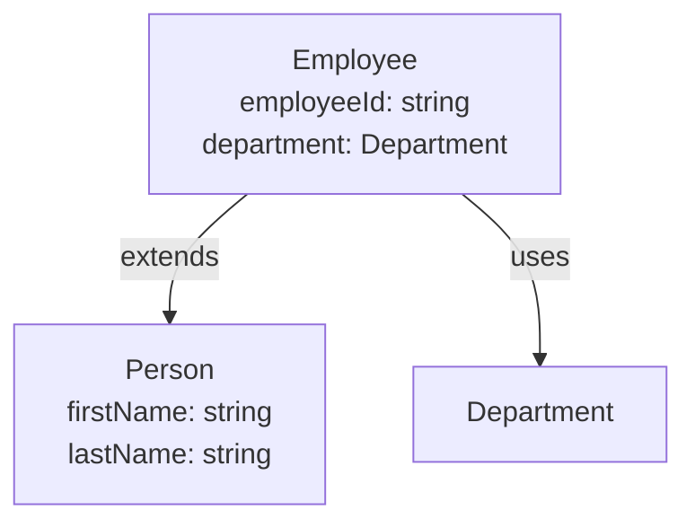
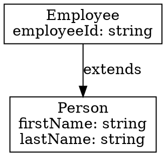

# FINOS CDM Viewer - User Guide

Welcome to the FINOS CDM Viewer extension for Visual Studio Code! This guide will help you get the most out of the extension's powerful features for working with FINOS Common Domain Model (CDM) files written in Rosetta DSL.

## Table of Contents

1. [Introduction](#introduction)
2. [Getting Started](#getting-started)
3. [Core Features](#core-features)
4. [Navigation Features](#navigation-features)
5. [Editing Features](#editing-features)
6. [Visualization Features](#visualization-features)
7. [Practical Workflows](#practical-workflows)
8. [Tips and Best Practices](#tips-and-best-practices)
9. [Troubleshooting](#troubleshooting)

---

## Introduction

### What is FINOS CDM Viewer?

FINOS CDM Viewer is a comprehensive VS Code extension designed to make working with FINOS Common Domain Model files easier and more productive. It provides:

- **Navigation**: Quickly browse and jump to type and enum definitions
- **Editing Support**: IntelliSense, code completion, and refactoring tools
- **Visualization**: Interactive graphs showing type relationships
- **Validation**: Real-time error detection and diagnostics
- **Export**: Generate documentation in multiple formats

### Who is this for?

- Financial domain modelers working with FINOS CDM
- Developers implementing CDM-based applications
- Technical writers documenting CDM schemas
- Anyone working with Rosetta DSL files

---

## Getting Started

### Prerequisites

- Visual Studio Code 1.85.0 or higher
- A workspace containing `.rosetta` files (e.g., FINOS CDM repository)

### Installation

See [INSTALLATION-ja.md](INSTALLATION-ja.md) for detailed installation instructions.

### Opening Your First CDM Project

1. **Clone the FINOS CDM repository** (if you don't have it):
   ```bash
   git clone https://github.com/finos/common-domain-model.git
   cd common-domain-model
   ```

2. **Open in VS Code**:
   ```bash
   code .
   ```

3. **Wait for indexing**: The extension will automatically index all `.rosetta` files in your workspace. This may take a few seconds for large projects.

4. **Look for the CDM Explorer**: Once indexing is complete, you'll see the "CDM Explorer" view in the Explorer sidebar.

---

## Core Features

### 1. CDM Explorer Tree View

The CDM Explorer provides a hierarchical view of all types and enums in your workspace.

**How to use:**

1. Find the "CDM Explorer" panel in the Explorer sidebar
2. Expand namespaces to see types and enums
3. Expand types to see:
   - Parent types (inheritance)
   - Fields with their types and cardinality
   - Validation conditions
4. Expand enums to see their values

**Example structure:**
```
📁 cdm.sample.test
  ├─ 📘 Person
  │   ├─ firstName: string (1..1)
  │   ├─ lastName: string (1..1)
  │   ├─ age: int (0..1)
  │   └─ address: Address (0..1)
  ├─ 📘 Employee (extends Person)
  │   ├─ employeeId: string (1..1) [metadata id]
  │   ├─ department: Department (1..1)
  │   └─ salary: number (0..1)
  └─ 🔢 Department
      ├─ ENGINEERING
      ├─ SALES
      └─ MARKETING
```

**Tips:**
- Click on any item to open its definition in the editor
- Use the refresh button (🔄) to manually update the tree
- The tree automatically updates when you save files

### 2. Syntax Highlighting

All `.rosetta` files are automatically highlighted with syntax coloring for:
- Keywords (`type`, `enum`, `namespace`, `extends`, etc.)
- Type names and references
- String literals and numbers
- Metadata annotations (`[metadata key]`, etc.)
- Comments
- Cardinality specifications (`0..1`, `1..*`, etc.)

**No configuration needed** - syntax highlighting is active as soon as you open a `.rosetta` file.

---

## Navigation Features

### 3. Hover Information

**How to use:**
- Hover your mouse over any type name or enum name

**What you'll see:**
- Type or enum description
- For types: list of fields with their types and cardinality
- For enums: list of values
- Namespace information

**Example:**
```
Hovering over "Address" shows:
┌────────────────────────────────────┐
│ Address                             │
│ Type from cdm.sample.test          │
│                                    │
│ Represents a physical address      │
│                                    │
│ Fields:                            │
│  • street: string (1..1)           │
│  • city: string (1..1)             │
│  • postalCode: string (1..1)       │
│  • country: Country (1..1)         │
└────────────────────────────────────┘
```

### 4. Go to Definition (F12)

**How to use:**
1. Place your cursor on a type or enum name
2. Press `F12` or `Cmd+Click` (macOS) / `Ctrl+Click` (Windows/Linux)

**What happens:**
- The editor jumps to the definition of that type or enum
- Works across different files in the workspace

**Use cases:**
- Following type inheritance chains
- Understanding field types
- Navigating complex domain models

### 5. Find All References (Shift+F12)

**How to use:**
1. Place your cursor on a type or enum name
2. Press `Shift+F12` or right-click → "Find All References"

**What you'll see:**
- A list of all locations where this type/enum is used
- Includes:
  - Type extensions (`Employee extends Person`)
  - Field type references (`address: Address`)
  - Function parameters and return types

**Example output:**
```
References to 'Address':
  sample.rosetta (3 references)
    Line 13: address Address (0..1)
    Line 18: type Address :
    Line 52: primaryAddress Address (1..1)
```

---

## Editing Features

### 6. Code Completion (Ctrl+Space / Cmd+Space)

The extension provides intelligent code completion in various contexts.

#### Type Completions

**When typing field types or extends clauses:**

```rosetta
type Employee extends P█    ← Press Ctrl+Space
```

**Suggestions:**
- Primitive types: `string`, `int`, `number`, `boolean`, `date`, `time`, `dateTime`, `zonedDateTime`
- Custom types from workspace: `Person`, `Address`, `Employee`, etc.

#### Keyword Completions

**At the start of a line:**

```rosetta
█    ← Press Ctrl+Space
```

**Suggestions with snippets:**
- `namespace` → `namespace ${1:name}`
- `type` → `type ${1:Name}:\n\t$0`
- `enum` → `enum ${1:Name}:\n\t$0`
- `extends` → `extends ${1:BaseType}`

#### Metadata Completions

**Inside metadata annotations:**

```rosetta
firstName string (1..1)
    [metadata █    ← Press Ctrl+Space
```

**Suggestions:**
- `key` - Marks field as unique identifier
- `id` - Marks field as identifier
- `reference` - Marks field as reference to another entity
- `scheme` - Associates field with classification scheme
- `calculation` - Marks field as calculated value

#### Cardinality Completions

**After opening parenthesis:**

```rosetta
firstName string (█    ← Press Ctrl+Space
```

**Suggestions:**
- `0..1` - Optional (zero or one)
- `1..1` - Required (exactly one)
- `0..*` - Zero or more
- `1..*` - One or more

### 7. Validation and Diagnostics

The extension validates your Rosetta files in real-time and shows errors with squiggly underlines.

#### Validation Rules

1. **Undefined Type References** (Error)
   ```rosetta
   address UnknownType (0..1)  ← Red squiggly line
           ~~~~~~~~~~~
   Error: Field type 'UnknownType' is not defined
   ```

2. **Circular Inheritance** (Error)
   ```rosetta
   type A extends B :
   type B extends A :  ← Red squiggly line
   Error: Type 'B' has circular inheritance
   ```

3. **Invalid Cardinality** (Error)
   ```rosetta
   age int (5..1)  ← Red squiggly line
           ~~~~~~
   Error: Invalid cardinality: min (5) > max (1)
   ```

4. **Duplicate Field Names** (Error)
   ```rosetta
   type Person :
       name string (1..1)
       name string (0..1)  ← Red squiggly line
       ~~~~
   Error: Duplicate field name 'name' in type 'Person'
   ```

5. **Empty Types** (Warning)
   ```rosetta
   type Empty :  ← Yellow squiggly line
        ~~~~~
   Warning: Type 'Empty' has no fields defined
   ```

#### When Validation Runs

- When you open a file
- When you save a file (also re-indexes the file)
- As you type (with 500ms debounce to avoid lag)
- When files change on disk

### 8. Rename Symbol (F2)

**How to use:**
1. Place cursor on a type or enum name
2. Press `F2` or right-click → "Rename Symbol"
3. Type the new name
4. Press `Enter`

**What happens:**
- The extension finds all occurrences (definition + references)
- Updates all files atomically
- Validates the new name before applying

**Validation checks:**
- New name must be in PascalCase (e.g., `MyType`, `PersonEnum`)
- No conflicts with existing symbols
- Not a primitive type name
- Not empty or same as old name

**Example:**
```
Before:                          After (renamed Address → Location):
type Person :                    type Person :
  address Address (0..1)   →       address Location (0..1)

type Address :                   type Location :
  street string (1..1)             street string (1..1)
```

---

## Visualization Features

### 9. Type Graph Visualization

**How to use:**

**Method 1: From cursor position**
1. Place cursor on a type name in the editor
2. Press `Cmd+Shift+P` / `Ctrl+Shift+P` → "CDM: Show Type Graph"
3. The graph will focus on that type

**Method 2: From command palette**
1. Press `Cmd+Shift+P` / `Ctrl+Shift+P`
2. Type "CDM: Show Type Graph"
3. Choose "Show all types" or "Enter type name"

**Method 3: From context menu**
1. Right-click in a `.rosetta` file
2. Select "CDM: Show Type Graph"

**What you'll see:**

An interactive Mermaid diagram showing:
- **Inheritance relationships**: Arrows from child to parent types
- **Field dependencies**: Connections showing which types use other types
- **Enum usage**: How enums are referenced in types

**Example graph for Employee:**
```
    Person
      ↑
      │ extends
      │
    Employee ──→ Department (enum)
      ↓ references
    Address ──→ Country (enum)
```

**Graph controls:**
- **Zoom**: Scroll wheel or pinch gesture
- **Pan**: Click and drag
- **Export**: Click "Export SVG" button to save diagram

**Use cases:**
- Understanding type hierarchies
- Finding dependencies before refactoring
- Creating documentation diagrams
- Analyzing impact of changes

### 10. Search and Filter

**How to use:**
1. Press `Cmd+Shift+P` / `Ctrl+Shift+P`
2. Type "CDM: Search Types and Enums"
3. Enter search query

**Search capabilities:**

#### Fuzzy Matching
- Type partial names: `pers` matches `Person`, `PersonId`, `ReversePerson`
- Character-by-character matching: `prn` matches `Person`
- Case-insensitive

#### Filter Buttons

After searching, use filter buttons to narrow results:

- **All** - Show all results (default)
- **Types** - Show only type definitions
- **Enums** - Show only enum definitions
- **Fields** - Show only field matches
- **By Namespace** - Filter by specific namespace
- **With Description** - Show only items with descriptions
- **Without Description** - Show only items missing descriptions

**Example workflow:**
```
1. Search for "address"
   Results: Address (type), addressLine (field), primaryAddress (field)

2. Click "Types" filter
   Results: Address (type)

3. Click "cdm.base" namespace filter
   Results: Address (type) from cdm.base namespace only
```

**Navigation:**
- Click any result to jump to its definition
- Results update as you refine filters

### 11. Export to Multiple Formats

**How to use:**
1. Press `Cmd+Shift+P` / `Ctrl+Shift+P`
2. Type "CDM: Export to JSON/Mermaid/GraphViz"
3. Choose export scope:
   - "Export all types" - Entire workspace
   - "Export specific type" - Single type with dependencies
   - "Export TypeName" - Current type under cursor (if available)
4. Choose format:
   - **JSON** - Complete type definitions
   - **Mermaid** - Diagram markup
   - **GraphViz** - DOT format for Graphviz

#### JSON Export

**Contains:**
- Complete type and enum definitions
- All fields with types, cardinality, metadata
- Descriptions and documentation
- Namespace organization

**Use cases:**
- API documentation generation
- Schema validation
- Tool integration
- Backup and versioning

**Example output:**
```json
{
  "exportDate": "2026-01-16T10:30:00Z",
  "version": "1.0.0",
  "namespaces": {
    "cdm.sample.test": {
      "types": [
        {
          "name": "Person",
          "description": "Represents a person",
          "fields": [
            {
              "name": "firstName",
              "type": "string",
              "cardinality": { "min": 1, "max": 1 }
            }
          ]
        }
      ]
    }
  }
}
```

#### Mermaid Export

**Contains:**
- Ready-to-use Mermaid diagram syntax
- Shows inheritance and field relationships
- Can be embedded in Markdown documentation

**Use cases:**
- GitHub/GitLab documentation
- Confluence pages
- Technical specifications
- README files

**Example output:**


#### GraphViz Export

**Contains:**
- DOT format for professional graph rendering
- Detailed type information
- Customizable layout

**Use cases:**
- High-quality printed documentation
- Technical presentations
- Architecture diagrams
- Professional publications

**Example output:**


---

## Practical Workflows

### Workflow 1: Understanding an Existing Type

**Goal:** Understand the `Employee` type and its relationships

1. **Find the type**: Use CDM Explorer or search (`Cmd+P` → `employee.rosetta`)
2. **View definition**: Click on `Employee` in the tree or press `F12`
3. **Check inheritance**: See `extends Person` - hover over `Person` for details
4. **Explore fields**: Expand `Employee` in the tree to see all fields
5. **Find usage**: Press `Shift+F12` on `Employee` to see where it's used
6. **Visualize**: Run "CDM: Show Type Graph" to see the full picture

### Workflow 2: Adding a New Type

**Goal:** Create a new `Department` type

1. **Open or create a `.rosetta` file**
2. **Start typing**: Type `type` and press `Tab` (snippet completion)
3. **Name the type**: `type Department :`
4. **Add fields**:
   ```rosetta
   name string (1..1)
       <"Department name">
   ```
   - Use `Ctrl+Space` for type completions
   - Use `Ctrl+Space` after `(` for cardinality completions
5. **Add metadata** if needed:
   ```rosetta
   [metadata key]
   ```
6. **Save**: The file is automatically validated
7. **Check for errors**: Fix any squiggly lines
8. **Test**: Try using the new type in another type's field

### Workflow 3: Refactoring a Type Name

**Goal:** Rename `Address` to `Location`

1. **Find the type**: Navigate to `Address` definition
2. **Check impact**: Press `Shift+F12` to see all references
3. **Rename**: Press `F2`, type `Location`, press `Enter`
4. **Verify**: All references are updated automatically
5. **Test**: Save all files and check validation errors
6. **Commit**: If using Git, review changes and commit

### Workflow 4: Documenting a Domain Model

**Goal:** Create documentation for the HR domain

1. **Identify types**: Use search to find all HR-related types
2. **Export to Mermaid**: Run "CDM: Export" → Select HR namespace → Mermaid
3. **Save the diagram**: Paste into `docs/hr-model.md`
4. **Export to JSON**: Export same types to JSON for API docs
5. **Generate type graph**: Create visual diagram for each major type
6. **Export to SVG**: Save SVG files for presentations

### Workflow 5: Validating Schema Changes

**Goal:** Ensure changes don't break existing definitions

1. **Make changes**: Edit type definitions
2. **Watch for errors**: Real-time validation shows issues immediately
3. **Fix undefined types**: Use code completion to select valid types
4. **Check circular dependencies**: Look for circular inheritance errors
5. **Verify cardinality**: Ensure min ≤ max
6. **Find affected types**: Use "Find All References" on changed types
7. **Update dependents**: Modify dependent types if needed
8. **Run full search**: Search for potentially affected patterns
9. **Export before/after**: Compare JSON exports to document changes

---

## Tips and Best Practices

### Performance Tips

1. **Large workspaces**: The initial indexing may take a few seconds. Subsequent updates are incremental and fast.
2. **Search efficiently**: Use specific search terms and filters to narrow results quickly
3. **Close unused graphs**: Type graph panels use memory - close them when done

### Productivity Tips

1. **Learn keyboard shortcuts**:
   - `F12` - Go to Definition (most used!)
   - `Shift+F12` - Find References
   - `F2` - Rename Symbol
   - `Ctrl+Space` - Code Completion

2. **Use code completion liberally**: It's faster than typing and prevents typos

3. **Leverage validation**: Don't wait to compile - fix errors as you type

4. **Export early, export often**: Generate diagrams during development for documentation

### Modeling Best Practices

1. **Add descriptions**: Use `<"description">` for all types, enums, and fields
   - Helps with documentation
   - Shows in hover tooltips
   - Aids team understanding

2. **Use meaningful names**: PascalCase for types/enums, camelCase for fields

3. **Check inheritance**: Use type graph to visualize hierarchies before adding `extends`

4. **Validate cardinality**: Be explicit about required vs. optional fields

5. **Document metadata**: Comment why fields have specific metadata annotations

---

## Troubleshooting

### CDM Explorer doesn't appear

**Solution:**
- Ensure workspace contains `.rosetta` files
- Try running "CDM: Refresh Explorer" from command palette
- Check that files aren't in excluded folders (e.g., `node_modules`)

### Code completion not working

**Solution:**
- Make sure you're in a `.rosetta` file
- Try typing a space or character to trigger
- Manually trigger with `Ctrl+Space` / `Cmd+Space`
- Check VS Code's IntelliSense settings

### Go to Definition doesn't work

**Solution:**
- Ensure the workspace is fully indexed (check status bar)
- Try "CDM: Refresh Explorer" to re-index
- Verify the type/enum exists in the workspace

### Validation errors seem wrong

**Solution:**
- Save the file to trigger re-indexing
- Check if dependent types are defined
- Look for typos in type names (case-sensitive)
- Verify primitive type names are lowercase

### Type graph won't load

**Solution:**
- Check if the type exists
- Try with a simpler type first
- Look for JavaScript errors in Developer Tools (Help → Toggle Developer Tools)

### Rename fails with "conflict" error

**Solution:**
- Check if target name already exists
- Ensure new name is in PascalCase
- Avoid primitive type names

### Performance is slow

**Solution:**
- Close unused editor tabs
- Close type graph panels when not needed
- Reduce number of open `.rosetta` files
- Check VS Code memory usage

---

## Getting Help

### Resources

- **GitHub Issues**: https://github.com/kkomazaw/finos-cdm-viewer/issues
- **FINOS CDM Documentation**: https://github.com/finos/common-domain-model
- **Rosetta DSL Documentation**: https://docs.rosetta-technology.io/

### Reporting Bugs

When reporting issues, please include:
1. VS Code version
2. Extension version (1.0.0)
3. Steps to reproduce
4. Example `.rosetta` file (if possible)
5. Error messages from Output panel (View → Output → "FINOS CDM Viewer")

### Feature Requests

We welcome feature requests! Please open an issue on GitHub with:
1. Description of the feature
2. Use case / why it's needed
3. Example of how it would work

---

## Summary

FINOS CDM Viewer provides a comprehensive development environment for working with Rosetta DSL and FINOS CDM:

✅ **Navigation**: CDM Explorer, Go to Definition, Find References, Hover Info
✅ **Editing**: Code Completion, Real-time Validation, Rename Symbol
✅ **Visualization**: Type Graphs, Search & Filter, Export to Multiple Formats

Start exploring your CDM models today! 🚀
