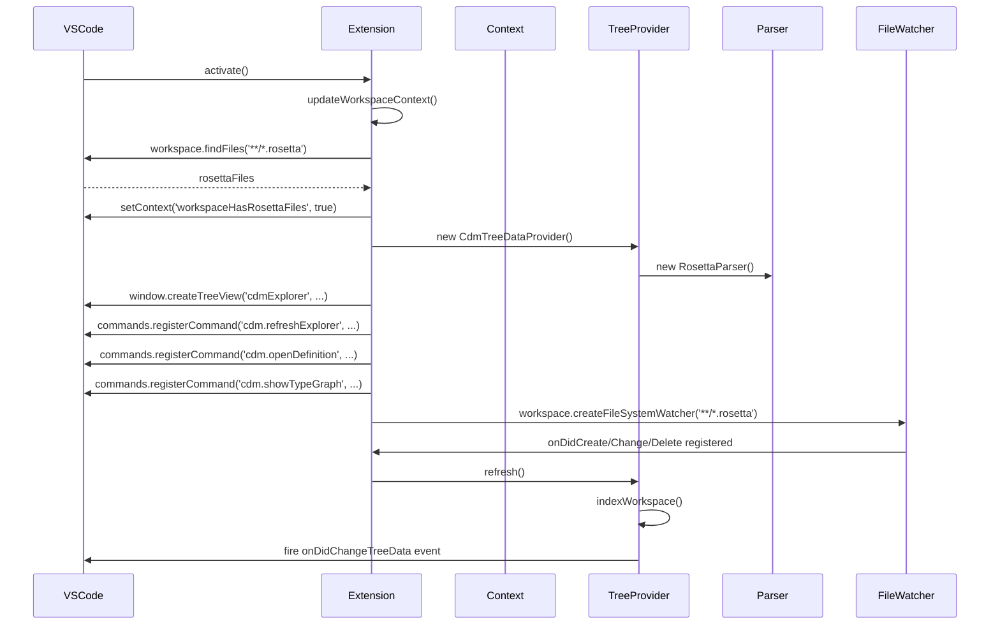
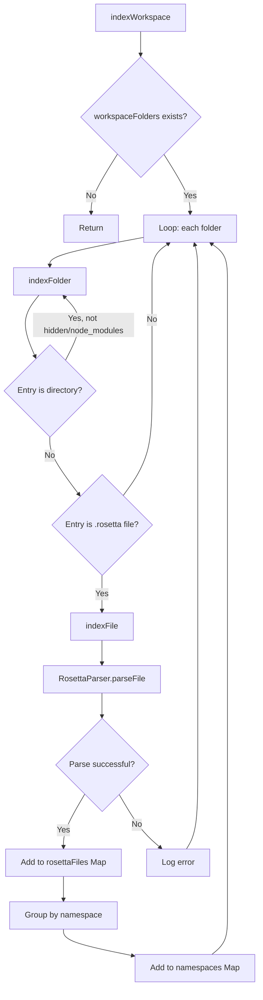
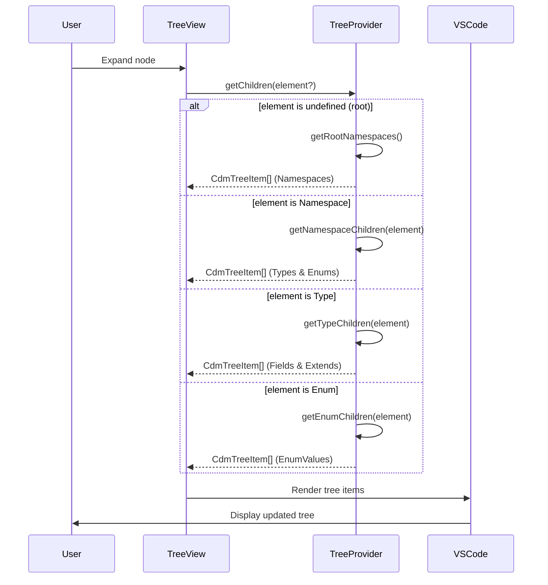
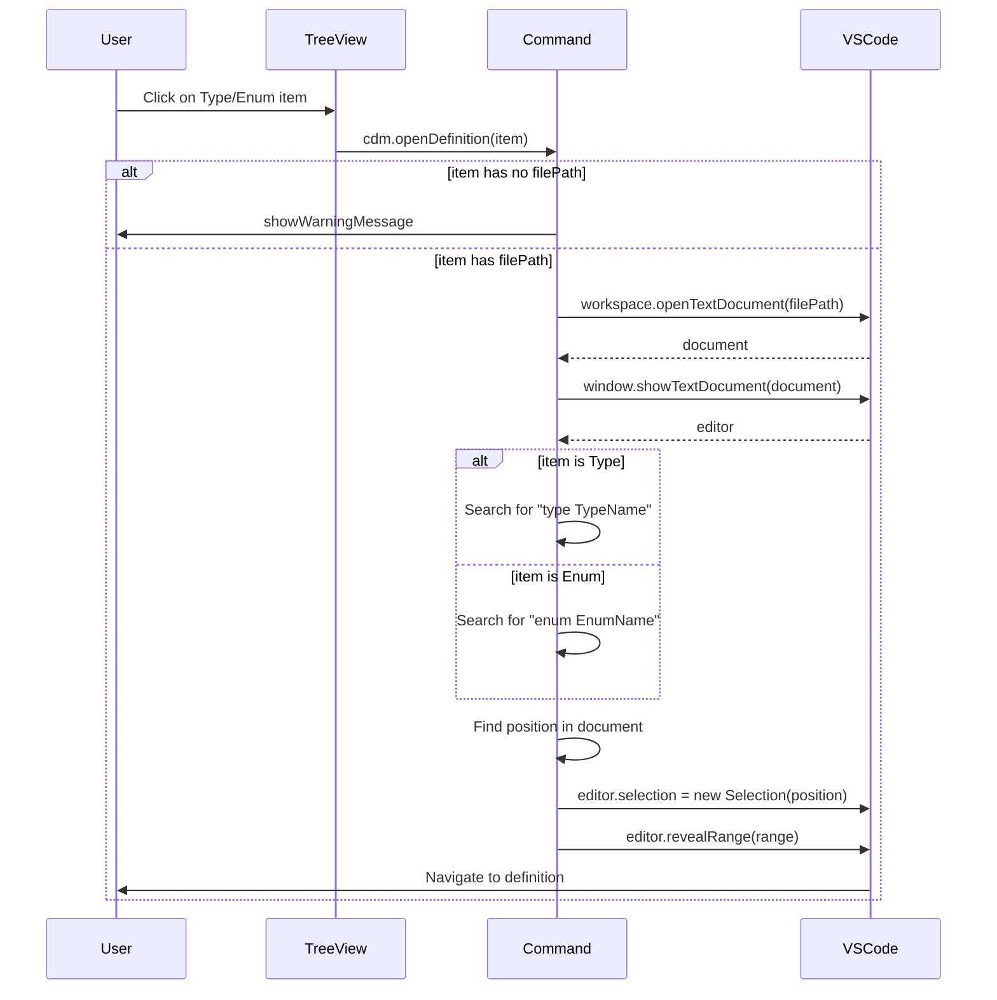
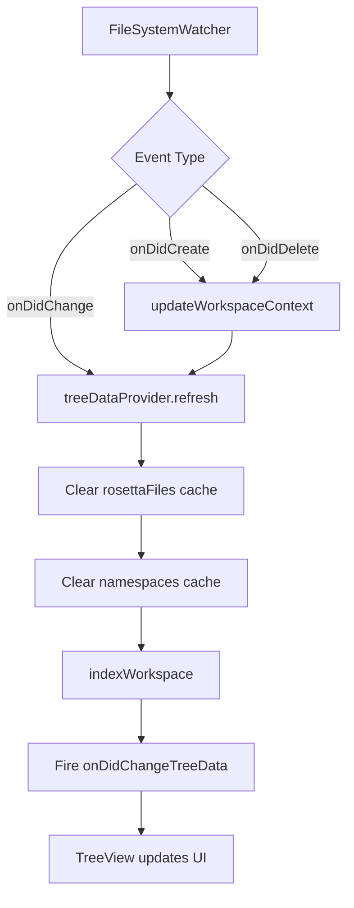

# FINOS CDM Viewer 詳細設計書

## 目次

1. [システム概要](#1-システム概要)
2. [アーキテクチャ設計](#2-アーキテクチャ設計)
3. [モジュール設計](#3-モジュール設計)
4. [データモデル設計](#4-データモデル設計)
5. [処理フロー設計](#5-処理フロー設計)
6. [UI/UX設計](#6-uiux設計)
7. [エラーハンドリング設計](#7-エラーハンドリング設計)
8. [パフォーマンス設計](#8-パフォーマンス設計)
9. [拡張性設計](#9-拡張性設計)

---

## 1. システム概要

### 1.1 目的

FINOS CDM Viewer は、FINOS Common Domain Model（CDM）のRosetta DSL ファイルを視覚的に表示・ナビゲートするためのVS Code拡張機能です。

### 1.2 主要機能

- **CDM Explorer Tree View**: CDMの型、列挙型、およびそれらの関係を階層的に表示
- **名前空間による整理**: 名前空間ごとに定義を自動整理
- **型ナビゲーション**: 型や列挙型の定義へのジャンプ機能
- **フィールド詳細表示**: フィールドのカーディナリティ、型、説明の表示
- **自動更新**: .rosettaファイルの変更を監視して自動更新

### 1.3 技術スタック

| 項目 | 技術 |
|-----|------|
| 言語 | TypeScript 5.3.3 |
| ランタイム | Node.js 18+ |
| フレームワーク | VS Code Extension API 1.85.0 |
| ビルドツール | TypeScript Compiler (tsc) |
| パッケージマネージャ | npm |

---

## 2. アーキテクチャ設計

### 2.1 全体アーキテクチャ

```
┌─────────────────────────────────────────────────────────┐
│                   VS Code Extension Host                 │
│                                                           │
│  ┌────────────────────────────────────────────────────┐ │
│  │              FINOS CDM Viewer Extension            │ │
│  │                                                     │ │
│  │  ┌──────────────┐        ┌──────────────────────┐ │ │
│  │  │  Extension   │        │  Command Handlers    │ │ │
│  │  │  Activation  │───────▶│  - refreshExplorer   │ │ │
│  │  │  (main)      │        │  - openDefinition    │ │ │
│  │  └──────┬───────┘        │  - showTypeGraph     │ │ │
│  │         │                └──────────────────────┘ │ │
│  │         │                                          │ │
│  │         ▼                                          │ │
│  │  ┌──────────────────────────────────────────────┐ │ │
│  │  │       CdmTreeDataProvider                    │ │ │
│  │  │  - getChildren()                             │ │ │
│  │  │  - getTreeItem()                             │ │ │
│  │  │  - refresh()                                 │ │ │
│  │  │  - indexWorkspace()                          │ │ │
│  │  └───────┬──────────────────────────────────────┘ │ │
│  │          │                                         │ │
│  │          ▼                                         │ │
│  │  ┌──────────────────────────────────────────────┐ │ │
│  │  │         RosettaParser                        │ │ │
│  │  │  - parseFile()                               │ │ │
│  │  │  - extractNamespace()                        │ │ │
│  │  │  - extractTypes()                            │ │ │
│  │  │  - extractEnums()                            │ │ │
│  │  └───────┬──────────────────────────────────────┘ │ │
│  │          │                                         │ │
│  │          ▼                                         │ │
│  │  ┌──────────────────────────────────────────────┐ │ │
│  │  │         RosettaAst Models                    │ │ │
│  │  │  - RosettaFile                               │ │ │
│  │  │  - RosettaType                               │ │ │
│  │  │  - RosettaEnum                               │ │ │
│  │  │  - ParseResult                               │ │ │
│  │  └──────────────────────────────────────────────┘ │ │
│  └─────────────────────────────────────────────────────┘ │
│                                                           │
│  ┌────────────────────────────────────────────────────┐ │
│  │              VS Code API Services                  │ │
│  │  - TreeView API                                    │ │
│  │  - FileSystemWatcher API                           │ │
│  │  - Workspace API                                   │ │
│  │  - Commands API                                    │ │
│  └────────────────────────────────────────────────────┘ │
└─────────────────────────────────────────────────────────┘
                          │
                          ▼
              ┌───────────────────────┐
              │  .rosetta Files       │
              │  (Workspace)          │
              └───────────────────────┘
```

### 2.2 レイヤー構成

| レイヤー | 役割 | 主要コンポーネント |
|---------|------|------------------|
| **プレゼンテーション層** | UI表示とユーザー操作 | CdmTreeDataProvider, CdmTreeItem |
| **アプリケーション層** | ビジネスロジックと制御 | Extension, Command Handlers |
| **ドメイン層** | ドメインモデル定義 | RosettaAst Models |
| **インフラストラクチャ層** | 外部リソースアクセス | RosettaParser, FileSystemWatcher |

### 2.3 データフロー

```
1. 拡張機能アクティベーション
   ↓
2. updateWorkspaceContext() - .rosettaファイル検索
   ↓
3. CdmTreeDataProvider.refresh()
   ↓
4. indexWorkspace() - ワークスペース内の全.rosettaファイルをスキャン
   ↓
5. RosettaParser.parseFile() - 各ファイルをパース
   ↓
6. RosettaFile AST生成
   ↓
7. 名前空間でグループ化
   ↓
8. TreeView更新
```

---

## 3. モジュール設計

### 3.1 extension.ts（エントリーポイント）

#### 3.1.1 責務

- 拡張機能のアクティベーション/デアクティベーション
- コマンドの登録
- TreeViewの登録
- ファイル監視の設定
- コンテキスト変数の管理

#### 3.1.2 主要関数

```typescript
// ワークスペースコンテキスト更新
async function updateWorkspaceContext(): Promise<boolean>

// 拡張機能アクティベーション
export function activate(context: vscode.ExtensionContext): void

// 拡張機能デアクティベーション
export function deactivate(): void
```

#### 3.1.3 登録コマンド一覧

| コマンドID | 機能 | 処理内容 |
|-----------|------|---------|
| `cdm.refreshExplorer` | エクスプローラー再読み込み | TreeDataProviderのrefresh()を呼び出し |
| `cdm.openDefinition` | 定義を開く | 型/列挙型の定義場所へジャンプ |
| `cdm.showTypeGraph` | 型グラフ表示（将来機能） | プレースホルダー実装 |

#### 3.1.4 イベントハンドリング

```typescript
// ファイル作成時
fileWatcher.onDidCreate(() => {
    updateWorkspaceContext();
    treeDataProvider.refresh();
});

// ファイル変更時
fileWatcher.onDidChange(() => treeDataProvider.refresh());

// ファイル削除時
fileWatcher.onDidDelete(() => {
    updateWorkspaceContext();
    treeDataProvider.refresh();
});
```

### 3.2 CdmTreeDataProvider.ts（ツリービュープロバイダー）

#### 3.2.1 クラス図

```
┌─────────────────────────────────────────────────────┐
│          CdmTreeDataProvider                        │
├─────────────────────────────────────────────────────┤
│ - parser: RosettaParser                             │
│ - rosettaFiles: Map<string, RosettaFile>            │
│ - namespaces: Map<string, RosettaFile[]>            │
│ - _onDidChangeTreeData: EventEmitter                │
├─────────────────────────────────────────────────────┤
│ + refresh(): void                                   │
│ + getTreeItem(element): TreeItem                    │
│ + getChildren(element?): Promise<CdmTreeItem[]>     │
│ - getRootNamespaces(): CdmTreeItem[]                │
│ - getNamespaceChildren(element): CdmTreeItem[]      │
│ - getTypeChildren(element): CdmTreeItem[]           │
│ - getEnumChildren(element): CdmTreeItem[]           │
│ - indexWorkspace(): void                            │
│ - indexFolder(folderPath): void                     │
│ - indexFile(filePath): void                         │
│ - formatCardinality(cardinality): string            │
│ + getFileForItem(item): RosettaFile | undefined     │
└─────────────────────────────────────────────────────┘
                      │
                      │ implements
                      ▼
      ┌────────────────────────────────────┐
      │  vscode.TreeDataProvider<T>        │
      └────────────────────────────────────┘
```

#### 3.2.2 データ構造

```typescript
// ファイルマップ
rosettaFiles: Map<string, RosettaFile>
// キー: ファイルパス（絶対パス）
// 値: パース済みRosettaFileオブジェクト

// 名前空間マップ
namespaces: Map<string, RosettaFile[]>
// キー: 名前空間名（例: "cdm.base"）
// 値: その名前空間に属するRosettaFileの配列
```

#### 3.2.3 ツリー階層構造

```
Root
├─ Namespace: cdm.base
│  ├─ Type: Party
│  │  ├─ Field: partyId: string (1..1)
│  │  └─ Field: name: string (0..1)
│  ├─ Type: Account
│  └─ Enum: AccountTypeEnum
│     ├─ EnumValue: CLIENT
│     └─ EnumValue: HOUSE
├─ Namespace: cdm.event
│  └─ Type: TradeEvent
└─ Namespace: cdm.product
```

#### 3.2.4 TreeItemType列挙型

```typescript
export enum TreeItemType {
    Namespace = 'namespace',   // 名前空間ノード
    Type = 'type',             // 型定義ノード
    Enum = 'enum',             // 列挙型ノード
    Field = 'field',           // フィールドノード
    EnumValue = 'enumValue',   // 列挙値ノード
    Folder = 'folder'          // フォルダノード（未使用）
}
```

#### 3.2.5 アイコンマッピング

| TreeItemType | VSCode ThemeIcon | 説明 |
|-------------|------------------|------|
| Namespace | `package` | パッケージアイコン |
| Type | `symbol-class` | クラスシンボル |
| Enum | `symbol-enum` | 列挙型シンボル |
| Field | `symbol-field` | フィールドシンボル |
| EnumValue | `symbol-enum-member` | 列挙値シンボル |

### 3.3 RosettaParser.ts（パーサー）

#### 3.3.1 パース戦略

正規表現ベースの軽量パーサーを採用。完全なASTパーサーではなく、構造的要素の抽出に特化。

#### 3.3.2 パース対象要素

```typescript
// 1. 名前空間宣言
namespace cdm.base : <"Base types for CDM">

// 2. バージョン宣言
version "5.0.0"

// 3. インポート文
import cdm.base.*

// 4. 型定義
type Party : <"Party definition"> {
    partyId string (1..1) <"Party identifier">
    name string (0..1)
}

// 5. 列挙型定義
enum AccountTypeEnum : <"Account type"> {
    CLIENT displayName "Client Account"
    HOUSE displayName "House Account"
}

// 6. カーディナリティ
(0..1)   // オプショナル単一
(1..1)   // 必須単一
(0..*)   // オプショナル複数
(1..*)   // 必須複数
```

#### 3.3.3 正規表現パターン

```typescript
// 名前空間
const namespaceRegex = /^namespace\s+([\w.]+)\s*:\s*<"([^"]*)">?/m;

// バージョン
const versionRegex = /^version\s+"([^"]+)"/m;

// インポート
const importRegex = /^import\s+([\w.*]+)/gm;

// 型定義
const typeRegex = /type\s+(\w+)(?:\s+extends\s+(\w+))?\s*:\s*<"([^"]*)">([\s\S]*?)(?=\ntype\s|\nenum\s|\nfunc\s|$)/g;

// フィールド定義
const fieldRegex = /^\s*(\w+)\s+([\w<>]+)\s+\(([^)]+)\)(?:\s*<"([^"]*)")?/gm;

// 列挙型定義
const enumRegex = /enum\s+(\w+)\s*:\s*<"([^"]*)">([\s\S]*?)(?=\ntype\s|\nenum\s|\nfunc\s|$)/g;

// 列挙値
const valueRegex = /(\w+)(?:\s+displayName\s+"([^"]+)")?(?:\s*<"([^"]*)">)?/g;

// カーディナリティ
const cardinalityRegex = /(\d+)\.\.(\d+|\*)/;
```

#### 3.3.4 エラーハンドリング

```typescript
interface ParseError {
    message: string;      // エラーメッセージ
    location: Location;   // エラー位置
    severity: 'error' | 'warning';  // 深刻度
}
```

パースエラーは致命的エラーとせず、ParseResult内のerrorsフィールドに蓄積。

### 3.4 RosettaAst.ts（データモデル）

#### 3.4.1 モデル関連図

```
RosettaFile
├─ namespace: RosettaNamespace?
├─ imports: RosettaImport[]
├─ types: RosettaType[]
│  ├─ fields: RosettaField[]
│  │  └─ cardinality: Cardinality
│  ├─ metadata: RosettaMetadata[]
│  └─ conditions: RosettaCondition[]
├─ enums: RosettaEnum[]
│  └─ values: RosettaEnumValue[]
└─ functions: RosettaFunction[]
   ├─ inputs: RosettaField[]
   └─ output: RosettaField?
```

#### 3.4.2 主要インターフェース

##### RosettaFile

```typescript
interface RosettaFile {
    filePath: string;           // ファイルの絶対パス
    namespace?: RosettaNamespace;  // 名前空間（省略可）
    imports: RosettaImport[];   // インポート文のリスト
    types: RosettaType[];       // 型定義のリスト
    enums: RosettaEnum[];       // 列挙型のリスト
    functions: RosettaFunction[]; // 関数定義のリスト
}
```

##### RosettaType

```typescript
interface RosettaType {
    name: string;               // 型名
    description?: string;       // 説明文
    extends?: string;           // 継承元型名
    metadata: RosettaMetadata[]; // メタデータ注釈
    fields: RosettaField[];     // フィールドリスト
    conditions: RosettaCondition[]; // バリデーション条件
    location: Location;         // ソースコード位置
}
```

##### RosettaField

```typescript
interface RosettaField {
    name: string;               // フィールド名
    type: string;               // 型名
    cardinality: Cardinality;   // カーディナリティ
    description?: string;       // 説明文
    metadata: RosettaMetadata[]; // メタデータ注釈
    location: Location;         // ソースコード位置
}
```

##### Cardinality

```typescript
interface Cardinality {
    min: number;                // 最小出現回数
    max: number | '*';          // 最大出現回数（'*'は無制限）
    isRequired: boolean;        // 必須かどうか（min > 0）
    isMultiple: boolean;        // 複数可かどうか（max > 1 or '*'）
}
```

##### RosettaEnum

```typescript
interface RosettaEnum {
    name: string;               // 列挙型名
    description?: string;       // 説明文
    values: RosettaEnumValue[]; // 列挙値のリスト
    location: Location;         // ソースコード位置
}
```

---

## 4. データモデル設計

### 4.1 パースデータのライフサイクル

```
.rosetta File (Disk)
      │
      ▼
File Content (string)
      │
      ▼ [RosettaParser.parse()]
ParseResult {
    file: RosettaFile,
    errors: ParseError[]
}
      │
      ▼ [CdmTreeDataProvider.indexFile()]
rosettaFiles: Map<string, RosettaFile>
      │
      ▼ [Grouping by namespace]
namespaces: Map<string, RosettaFile[]>
      │
      ▼ [CdmTreeDataProvider.getChildren()]
CdmTreeItem[]
      │
      ▼ [VS Code TreeView API]
UI表示
```

### 4.2 キャッシュ戦略

現在の実装では、`CdmTreeDataProvider`がメモリ内キャッシュを保持：

```typescript
private rosettaFiles: Map<string, RosettaFile> = new Map();
private namespaces: Map<string, RosettaFile[]> = new Map();
```

- **キャッシュ更新**: `refresh()`呼び出し時に全キャッシュをクリアして再構築
- **ファイル変更検知**: FileSystemWatcherで.rosettaファイルの変更を監視

### 4.3 メモリ使用量の見積もり

| 項目 | 概算サイズ |
|-----|----------|
| RosettaFile 1個 | ~5-10 KB |
| FINOS CDM全体（~150ファイル） | ~1-2 MB |
| TreeItem生成コスト | ~100-200 KB |
| 合計メモリ使用量 | ~50-100 MB |

---

## 5. 処理フロー設計

### 5.1 拡張機能アクティベーションフロー



### 5.2 ワークスペースインデックス化フロー



### 5.3 ツリー表示更新フロー



### 5.4 定義ジャンプフロー



### 5.5 ファイル変更監視フロー



---

## 6. UI/UX設計

### 6.1 TreeView階層設計

#### 6.1.1 表示形式

```
📦 cdm.base
  ├─ 🔷 Party
  │   ├─ 🔹 partyId: string (1..1)
  │   └─ 🔹 name: string (0..1)
  ├─ 🔷 Account
  │   ├─ extends Party
  │   ├─ 🔹 accountId: string (1..1)
  │   └─ 🔹 accountType: AccountTypeEnum (1..1)
  └─ 🔶 AccountTypeEnum
      ├─ 🔸 CLIENT
      └─ 🔸 HOUSE
```

#### 6.1.2 アイコン凡例

| アイコン | 意味 | TreeItemType |
|---------|------|-------------|
| 📦 | 名前空間 | Namespace |
| 🔷 | 型定義 | Type |
| 🔶 | 列挙型 | Enum |
| 🔹 | フィールド | Field |
| 🔸 | 列挙値 | EnumValue |

### 6.2 コマンドパレット

| コマンド | ショートカット | 表示名 |
|---------|--------------|-------|
| `cdm.refreshExplorer` | - | CDM: Refresh Explorer |
| `cdm.showTypeGraph` | - | CDM: Show Type Graph |

### 6.3 コンテキストメニュー

TreeView タイトルバー：
- 🔄 Refresh（`cdm.refreshExplorer`）

### 6.4 Hover情報

```typescript
// 現在の実装
provideHover(document, position) {
    const word = document.getText(range);
    return new vscode.Hover(`**${word}**\n\n*Type information will be available in future versions*`);
}
```

将来的には型情報を表示予定。

### 6.5 ツールチップ

| TreeItemType | ツールチップ内容 |
|-------------|----------------|
| Type | `Type: TypeName` または description |
| Enum | `Enum: EnumName` または description |
| Field | `Field: fieldName` または description |
| EnumValue | ラベルテキスト |
| Namespace | 名前空間名 |

---

## 7. エラーハンドリング設計

### 7.1 エラー分類

| エラーレベル | 対応方針 | 通知方法 |
|------------|---------|---------|
| **Critical** | 拡張機能停止 | エラーメッセージダイアログ |
| **Error** | 機能制限付き継続 | エラーメッセージ + ログ |
| **Warning** | 継続動作 | ログのみ |
| **Info** | 正常動作 | 情報メッセージ |

### 7.2 エラーハンドリングポイント

#### 7.2.1 パース エラー

```typescript
// RosettaParser.parse()
try {
    const file: RosettaFile = { ... };
    return { file, errors };
} catch (error) {
    errors.push({
        message: `Failed to parse file: ${error}`,
        location: { line: 0, column: 0, length: 0 },
        severity: 'error'
    });
    // 空のファイルオブジェクトを返して継続
    return { file: emptyFile, errors };
}
```

#### 7.2.2 ファイルアクセスエラー

```typescript
// CdmTreeDataProvider.indexFolder()
try {
    const entries = fs.readdirSync(folderPath, { withFileTypes: true });
    // ...
} catch (error) {
    console.error(`Error indexing folder ${folderPath}:`, error);
    // 継続（他のフォルダの処理は続行）
}
```

#### 7.2.3 定義ジャンプエラー

```typescript
// extension.ts - cdm.openDefinition
try {
    const document = await vscode.workspace.openTextDocument(item.filePath);
    // ...
} catch (error) {
    vscode.window.showErrorMessage(`Failed to open file: ${error}`);
}
```

### 7.3 エラーログ出力

```typescript
// コンソールログ
console.log('FINOS CDM Viewer extension is now active');
console.error(`Error indexing folder ${folderPath}:`, error);
console.warn(`Errors parsing ${filePath}:`, result.errors);
```

### 7.4 ユーザー通知

```typescript
// 情報メッセージ
vscode.window.showInformationMessage('CDM Explorer refreshed');
vscode.window.showInformationMessage('Type graph visualization coming soon!');

// 警告メッセージ
vscode.window.showWarningMessage('No file path available for this item');

// エラーメッセージ
vscode.window.showErrorMessage(`Failed to open file: ${error}`);
```

---

## 8. パフォーマンス設計

### 8.1 パフォーマンス目標

| 操作 | 目標時間 | 備考 |
|-----|---------|------|
| 拡張機能アクティベーション | < 1秒 | 初回インデックス化を除く |
| 初回インデックス化（150ファイル） | 2-5秒 | FINOS CDM全体 |
| 単一ファイルパース | 50-100ms | 増分更新時 |
| TreeView 展開 | < 100ms | ノード展開時 |
| 定義ジャンプ | < 200ms | ファイルオープン + ナビゲート |

### 8.2 最適化戦略

#### 8.2.1 遅延ロード（Lazy Loading）

TreeViewは階層的に遅延ロード：
- ルートレベル: 名前空間のみ
- 名前空間展開時: その名前空間の型/列挙型のみ
- 型展開時: そのフィールドのみ

```typescript
async getChildren(element?: CdmTreeItem): Promise<CdmTreeItem[]> {
    if (!element) {
        // ルートレベル: 名前空間のみ
        return this.getRootNamespaces();
    }
    // ...以降、必要なノードのみ生成
}
```

#### 8.2.2 インクリメンタルパース

ファイル変更時は全体を再パースせず、変更されたファイルのみパース：

```typescript
fileWatcher.onDidChange(() => treeDataProvider.refresh());
// 現在はrefresh()で全体再構築だが、将来的には増分更新可能
```

#### 8.2.3 メモリ効率

- Mapデータ構造使用: O(1)アクセス
- 不要なデータの保持を避ける（例: ファイル内容の文字列は保持しない）
- TreeItem生成は必要最小限（展開時のみ）

#### 8.2.4 並列処理

現在は同期処理だが、将来的には以下を検討：
- 複数ファイルの並列パース（Worker Threads）
- 大規模ワークスペースでのバックグラウンドインデックス化

### 8.3 パフォーマンス計測

```typescript
// 将来的な実装例
const startTime = performance.now();
this.indexWorkspace();
const endTime = performance.now();
console.log(`Indexing took ${endTime - startTime}ms`);
```

### 8.4 スケーラビリティ

| ファイル数 | 予想パース時間 | メモリ使用量 |
|----------|--------------|------------|
| 10 | < 0.5秒 | ~10 MB |
| 50 | 1-2秒 | ~30 MB |
| 150（FINOS CDM） | 2-5秒 | 50-100 MB |
| 500 | 10-15秒 | 150-300 MB |

---

## 9. 拡張性設計

### 9.1 プラグインアーキテクチャ

将来的なプラグイン機能の拡張ポイント：

```typescript
// 拡張ポイント1: カスタムパーサー
interface IParser {
    parseFile(filePath: string): ParseResult;
    parse(content: string, filePath?: string): ParseResult;
}

// 拡張ポイント2: カスタムTreeItemプロバイダー
interface ITreeItemProvider {
    getChildren(element?: TreeItem): Promise<TreeItem[]>;
    getTreeItem(element: TreeItem): TreeItem;
}

// 拡張ポイント3: カスタムビジュアライザー
interface IVisualizer {
    visualize(type: RosettaType): void;
}
```

### 9.2 設定による拡張

`package.json`の`contributes.configuration`で設定可能：

```json
{
  "cdm.sourcePath": "",
  "cdm.enableCache": true,
  "cdm.maxCacheSize": 100
}
```

将来追加予定の設定：
- `cdm.parserMode`: "strict" | "lenient"
- `cdm.indexingStrategy`: "eager" | "lazy"
- `cdm.visualizationEngine`: "mermaid" | "graphviz"

### 9.3 イベント駆動アーキテクチャ

現在のイベント：
- `onDidChangeTreeData`: TreeView更新時

将来追加予定のイベント：
- `onTypeSelected`: 型選択時
- `onParseCompleted`: パース完了時
- `onIndexUpdated`: インデックス更新時

### 9.4 API 拡張

拡張機能が他の拡張機能に公開できるAPI：

```typescript
export interface CdmViewerAPI {
    // 型情報の取得
    getType(name: string): RosettaType | undefined;

    // 名前空間内のすべての型を取得
    getTypesInNamespace(namespace: string): RosettaType[];

    // パース済みファイル一覧
    getAllFiles(): RosettaFile[];

    // 再インデックス化のトリガー
    reindex(): Promise<void>;
}

// 他の拡張機能から利用
const cdmViewer = vscode.extensions.getExtension<CdmViewerAPI>('finos-community.finos-cdm-viewer');
const api = cdmViewer?.exports;
const party = api?.getType('Party');
```

### 9.5 将来機能の実装ロードマップ

#### Phase 2（次期バージョン）

- [ ] 強化されたHover情報（型詳細表示）
- [ ] Go to Definition（型参照からの定義ジャンプ）
- [ ] Find All References（型の参照箇所検索）
- [ ] Rosetta DSLのシンタックスハイライト

#### Phase 3（将来バージョン）

- [ ] 型グラフの視覚化（Mermaid/GraphViz）
- [ ] 検索・フィルタ機能
- [ ] エクスポート機能（JSON, GraphViz, PlantUML）
- [ ] バリデーション機能とエラーハイライト
- [ ] インテリセンス（オートコンプリート）
- [ ] リファクタリング機能（リネーム等）

---

## 10. テスト設計

### 10.1 テスト戦略

| テストレベル | 対象 | ツール |
|------------|------|-------|
| 単体テスト | 各クラス/関数 | Mocha + Chai |
| 統合テスト | モジュール間連携 | VS Code Test API |
| E2Eテスト | UI操作 | VS Code Extension Tester |

### 10.2 テストケース例

#### 10.2.1 RosettaParser

```typescript
describe('RosettaParser', () => {
    it('should parse namespace declaration', () => {
        const content = 'namespace cdm.base : <"Base types">';
        const result = parser.parse(content);
        expect(result.file.namespace?.name).to.equal('cdm.base');
    });

    it('should parse type with fields', () => {
        const content = `
            type Party : <"Party definition"> {
                partyId string (1..1)
            }
        `;
        const result = parser.parse(content);
        expect(result.file.types).to.have.lengthOf(1);
        expect(result.file.types[0].fields).to.have.lengthOf(1);
    });
});
```

#### 10.2.2 CdmTreeDataProvider

```typescript
describe('CdmTreeDataProvider', () => {
    it('should return namespaces at root level', async () => {
        const children = await provider.getChildren();
        expect(children.every(c => c.type === TreeItemType.Namespace)).to.be.true;
    });

    it('should return types and enums for namespace', async () => {
        const namespaceItem = new CdmTreeItem('cdm.base', ...);
        const children = await provider.getChildren(namespaceItem);
        expect(children.length).to.be.greaterThan(0);
    });
});
```

### 10.3 テストデータ

`test/fixtures/`ディレクトリにサンプル.rosettaファイルを配置：

```
test/
└── fixtures/
    ├── simple-type.rosetta
    ├── enum-definition.rosetta
    ├── inheritance.rosetta
    └── complex-model.rosetta
```

---

## 11. デプロイメント設計

### 11.1 ビルドプロセス

```bash
# 開発ビルド
npm run compile

# Watch モード
npm run watch

# プロダクションビルド（公開前）
npm run vscode:prepublish
```

### 11.2 パッケージング

```bash
# .vsix パッケージ作成
vsce package

# 出力
# finos-cdm-viewer-0.1.0.vsix
```

### 11.3 公開

```bash
# VS Code Marketplace に公開
vsce publish

# 特定バージョンで公開
vsce publish 0.2.0
```

### 11.4 バージョニング

セマンティックバージョニング（SemVer）に従う：

- **MAJOR**: 互換性のない変更
- **MINOR**: 後方互換性のある機能追加
- **PATCH**: 後方互換性のあるバグ修正

例: `0.1.0` → `0.2.0` (新機能) → `0.2.1` (バグ修正) → `1.0.0` (安定版)

---

## 12. セキュリティ設計

### 12.1 入力検証

- ファイルパスの検証（パストラバーサル対策）
- 正規表現のDoS攻撃対策（ReDoS）
- ファイルサイズ制限（巨大ファイルによるメモリ枯渇対策）

### 12.2 権限管理

- ワークスペースフォルダ内のファイルのみアクセス
- システムファイルへのアクセス制限

### 12.3 依存関係管理

```bash
# 脆弱性チェック
npm audit

# 自動修正
npm audit fix
```

---

## 13. 付録

### 13.1 Rosetta DSL 文法仕様（簡易版）

```ebnf
file ::= namespace? version? import* definition*
namespace ::= "namespace" IDENTIFIER ":" "<" STRING ">"
version ::= "version" STRING
import ::= "import" IDENTIFIER (".*")?
definition ::= typeDefinition | enumDefinition | functionDefinition

typeDefinition ::= "type" IDENTIFIER ("extends" IDENTIFIER)? ":" "<" STRING ">" "{" field* condition* "}"
field ::= IDENTIFIER IDENTIFIER "(" cardinality ")" ("<" STRING ">")?
cardinality ::= NUMBER ".." (NUMBER | "*")

enumDefinition ::= "enum" IDENTIFIER ":" "<" STRING ">" "{" enumValue* "}"
enumValue ::= IDENTIFIER ("displayName" STRING)? ("<" STRING ">")?
```

### 13.2 用語集

| 用語 | 説明 |
|-----|------|
| CDM | Common Domain Model - FINOS が策定する金融業界の共通ドメインモデル |
| Rosetta | CDM を記述するための DSL（Domain Specific Language） |
| AST | Abstract Syntax Tree - 抽象構文木 |
| Cardinality | カーディナリティ - フィールドの出現回数（0..1, 1..*, など） |
| TreeDataProvider | VS Code が提供するツリービュー表示用のインターフェース |

### 13.3 参考資料

- [FINOS Common Domain Model](https://github.com/finos/common-domain-model)
- [Rosetta DSL Documentation](https://docs.rosetta-technology.io/)
- [VS Code Extension API](https://code.visualstudio.com/api)
- [VS Code TreeView API](https://code.visualstudio.com/api/extension-guides/tree-view)

---

## 改訂履歴

| バージョン | 日付 | 変更内容 | 作成者 |
|----------|------|---------|-------|
| 1.0 | 2026-01-15 | 初版作成 | Claude |

